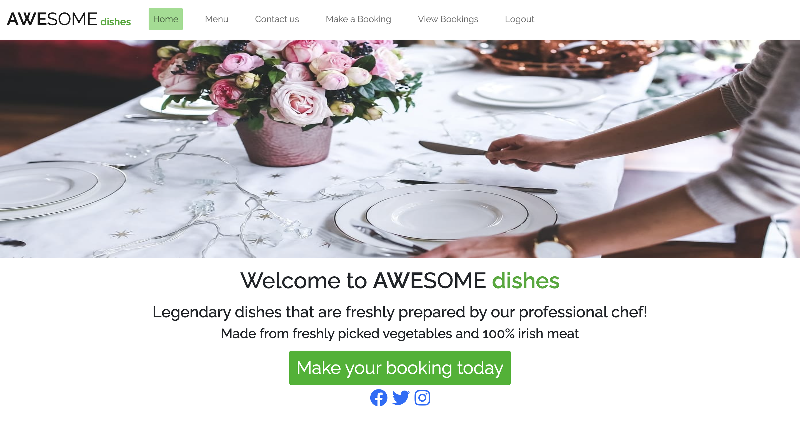

# Awesome Dishes

Welcome to the readme file of my project.

## Introduction

This programme is designed to allow an user to make and cancel bookings online. The programme connects the codes that are used front-end and backend to do this. In order to make a successful website, HTML, CSS, Javascript, Django, Python have to be used in combination.

You can find a link to my website [here](https://awesome-dishes.herokuapp.com/).

# Table of Contents
[1.User Experience(UX)](#1-user-experience)
- 1.1 User Goals
- 1.2 User Expectations
- 1.3 User Stories
- 1.4 Wireframe
- 1.5 Strategy Tables

[2.Features](#2-features)

[3.Technology](#3-technology)

[4.Testing](#4-testing)

[5.Bugs](#5-bugs)

[6.Deployment](#6-deployment)

[7.Project Completion](#7-project-completion)

[8.Improvements](#8-improvements)

[9.Acknowledgements](#9-acknowledgements)

# 1. User Experience

## 1.1 User Goals

[Return to the Table of Contents](#table-of-contents)

My goal in creating this programme is for customers and visitors of the website to be able to make bookings once they see the kind of food the restaurant offers. Likewise, I want to give them the option of deleting a booking if they change their mind.

## 1.2 User Expectations

[Return to the Table of Contents](#table-of-contents)

The following are expected of the website:

* Should be easily accessible.
* The language should be in simple English.
* The user should be able to login and out easily.
* The user should be able to make and edit bookings without hassle. They can choose the time and date, they want their booking to be on.
* The user should be able to delete bookings if they can't make it.
* The user can sign up to the website if they haven't an account. 
* The user should be able to see a list of all their previous bookings.
* The user should be able to access the website on different devices, not just through the computer.
* The user should be able to view the menu and contact the restaurant if needed.

## 1.3 User Stories

[Return to the Table of Contents](#table-of-contents)

Throughout the project, I used github user stories to record and keep track of my tasks. At the beginning, I listed all the things I needed to do, moved them to the second column when I am working on them and finally to the last column when I am done with that task.


## 1.4 Wireframes

[Return to the Table of Contents](#table-of-contents)

### Mobile Wireframe

This was what I had in mind when I was coming up with the skeleton of the project. It was going to be a navigation bar at the too with the logo, followed by a picture, then the rest of the information.


### Website Wireframe


## 1.5 Strategy Table

Opportunity/Problem/Feature| Importance| Viability/Feasibility
------------ | -------------------------|---------
Display a food Menu | 5 | 5
Account signup | 5 | 5
Responsive design | 5 | 5
Contact form | 4 | 5
Ability to create a booking | 5 | 4
Ability to update a booking | 5 | 4
Ability to cancel a booking | 3 | 4
Ability to view previous bookings | 4 | 5
Account login/logout | 5 | 5
Multiple table occupancies | 4 | 1
Avoid double bookings | 4 | 1

It isn't easy to include everything in the above table. Therefore, I have listed them according to their importance and would follow this list.

# 2. Features

[Return to the Table of Contents](#table-of-contents)

## 2.1 Navigation Bar

The navigation bar is placed at the top of all pages. The navigation bar is dynamic in that meaning depending on if the user is logged in or not the options will change.
- If the user is not logged in the navigation bar will not have the logout or manage booking header. Likewise, when the user tries to make a booking, a message would pop up to say that the user must first login.
- If the user is logged in the navigation bar will not have the login or register function. Instead the logout and manage booking header would appear. The user would also be able to make a booking, edit that booking or delete it.
- The footer is placed at the bottom of each page with social media icons. These icons will open the links in a new tab.
- The restaurant logo is also placed at the top of all pages. Clicking on it will also direct the user to the home page.
- The navigation bar would change depending on whether the user is using a laptop or a tablet or a phone. On a computer, the navigation bar would look like this.



On a tablet or a phone, the navbar would look like this.


When toggled, it would look like this.


## 2.2 Login, Signup and Logout

The login function would allow the user to signin if the user already has an account.


If the user doesn't have an account, then s/he can sign up for one.


And when a user wants to logout of their account, they can use the logout function.


If the email or password is incorrect when signing in, the following would appear.


## 2.3 Menu, Contacts and Homepage

The menu, contacts and homepage respectively, shows the restaurant's menu, the restaurant's contact information and the website's homepage.


## 2.4 Making a Booking

This page allows the user to make a booking provided that the user is logged in. If the user isn't, the following error would appear.


Once the user logs in, the message would disappear to show this.


When the button is clicked, the following would appear.


## 2.5 Edit a Booking and Deleting a Booking

Once a booking has been made, the user can still edit it if they believe that some of the information is no longer relevant to their situation. They can press the modify booking button on the booking they want to change and the following should appear.


They can also choose to delete the booking by pressing the delete button. The following would appear if the user presses the delete button.


The user can then choose yes or no. If the user chooses no, then they would be transferred back to the reservations page without changing any of the booking information. But if the user chooses yes, the booking would be deleted.

## 2.6 Manage all bookings

When the user chooses the view bookings header, s/he would be directed to the page below.


This page shows the user all the bookings s/he has made so far with this account and would also tell him/her whether the booking has been approved or not. It also shows them the information that have inserted and gives them the option to change it if needs be. If more than six bookings have been made altogether, at the bottom of this page, a link to the next page would appear. Likewise, if the patient is on the next page, a button would appear, giving the user the option to return to the prvious page.


# 3. Technology

[Return to the Table of Contents](#table-of-contents)

* [MD](https://en.wikipedia.org/wiki/Markdown) (Markdown) was used to create this readme file.

* [Gitpod](https://www.gitpod.io/) was used for the code input and edit for this project.

* [Github](https://github.com/) was used to store my repository and code when it is not in use.

* [Slack](https://slack.com/intl/en-ie/) was used for communications when I was having trouble creating code.

* [Pep8 Validator](http://pep8online.com/) was used to check for bugs in my code.

* [Heroku](https://id.heroku.com/login) was used to deploy my project.

* [Python](https://en.wikipedia.org/wiki/Python_(programming_language)) was used to create the website.

* [JS](https://en.wikipedia.org/wiki/JavaScript)(JavaScript) was used to make the website.

* [HTML5](https://en.wikipedia.org/wiki/HTML5) (Hypertext Markup Language 5) was used to create the webpages.

* [CSS](https://en.wikipedia.org/wiki/CSS) (Cascading Style Sheets) was used to style the webpages.

* [PostgreSQL](https://www.postgresql.org/) was used as a database.

* [Pixabay](https://pixabay.com/) was used to download images. These images were then uploaded onto Cloudinary.

* [Cloudinary](https://cloudinary.com/) was used as a database to store images.

* [Google Fonts](https://fonts.google.com/) was used to import the font style for my project.

* [W3C Markup](https://validator.w3.org/),[Jigsaw validation](https://jigsaw.w3.org/) and [JSHint](https://jshint.com/) tools were used to check for bugs in my code.

* [Auto Draw](https://www.autodraw.com/) was used to create my webframes.

# 4. Testing

[Return to the Table of Contents](#table-of-contents)

The contents of the testing section can be find [here](testing.md).

# 5. Bugs

[Return to the Table of Contents](#table-of-contents)

There were no major error overall but after deployment, I realised that even though I had both the email and the password correct, I couldn't login with them again. This was resolved by adding the following to the settings.py file.
'''
AUTHENTICATION_BACKENDS = (
    # Needed to login by username in Django admin, regardless of `allauth`
    "django.contrib.auth.backends.ModelBackend",
    # `allauth` specific authentication methods, such as login by e-mail
    "allauth.account.auth_backends.AuthenticationBackend"
)
'''

There are a lot of minor mistakes however and these are recorded in detail in the testing.md file in which you can access [here](testing.md).

# 6. Deployment

[Return to the Table of Contents](#table-of-contents)

The site was deployed to Heroku using the following steps:

- Install Django and the supporting libraries
    - Install Django and Gunicorn. Gunicorn is the server that is used to run Django on Heroku.
    - Install support libraries including psycopg2, this was used to connect the PostgreSQL database.
    - Install Cloudinary libraries, this is a host provider service that stores images.
    - The requirements.txt file was created to include the project's dependencies which allowed us to run the project in Heroku.

- Create a new, blank Django Project
    - Create a new project
    - Create the app
    - Add reservations to the installed apps in settings.py
    - Migrate all new changes to the database
    - Run the server to test

- Setup project to use Cloudinary and PostgreSQL
    - Create new Heroku app
        - Sign into Heroku
        - Select New
        - Select create new app
        - Enter a relevant app name
        - Select appropriate region
        - Select the create app button

    - Attach PostgreSQL database
        - In Heroku go to resources
        - Search for Postgres in the add-ons box
        - Select Heroku Postgres
        - Submit order form

    - Prepare the environment and settings.py file
        - Create env.py file
        - Add DATABASE_URL with the Postgres URL from Heroku
        - Add SECRET_KEY with a randomly generated key
        - Add SECRET_KEY and generated key to the config vars in Heroku
        - Add if statement to settings.py to prevent the production server from erroring
        - Replace insecure key with the environment variable for the SECRET_KEY
        - Add Heroku database as the back end
        - Migrate changes to new database

    - Get static media files stored on Cloudinary
        - Create a Cloudinary account
        - From the dashboard, copy the API Environment variable
        - In the settings.py file create a new environment variable for CLOUDINARY_URL
        - Add the CLOUDINARY_URL variable to Heroku
        - Add a temporary config var for DISABLE_COLLECTSTATIC
        - In settings.py add Cloudinary as an installed app
        - Add static and media file variables
        - Add templates directory
        - Change DIR's key to point to TEMPALTES_DIR
        - Add Heroku hostname to allowed hosts
        - Create directories for media, static and templates in the project workspace
        - Create a Procfile

- Deploy new empty project to Heroku

- Set debug = False in the settings.py file of the repository
- Commit and push all files to GitHub.
- In Heroku, remove the DISABLE_COLLECTSTATIC config var.
- In the deploy tab, go to the manual deploy sections and click deploy branch.

# 7. Project Completion

[Return to the Table of Contents](#table-of-contents)

## Desktop Version


## Mobile Version


# 8. Improvements

[Return to the Table of Contents](#table-of-contents)
This is a resubmission attempt since the last one didn't meet the project's criteria. I had some problems highlighting some of the navigation headings since they are built into allauth. I didn't know where to go to find and adjust the code in order to highlight the headings so I left them as they were. Alsom in order to edit the edit booking section, the code wasn't user friendly. I didn't know where to go to adjust this problem either, hence I left it as it was.

# 9. Acknowledgements

[Return to the Table of Contents](#table-of-contents)

* Credits is given to [iKelvv](https://github.com/iKelvvv/MS4) for given me some code to be used in the programme. This is the code that was implemented into my programme in which I modified.
```
class EditBooking(View):
    model = Booking
    template_name = 'edit_booking.html'
    context_object_name = 'edit_booking'

    def get(self, request, booking_id, *args, **kwargs):
        booking = get_object_or_404(Booking, pk=booking_id)

        return render(
            request,
            "edit_booking.html",
            {
                "booking": booking,
                "updated": False,
                "Update_Booking": UpdateBooking(instance=booking)
            },
        )

    def post(self, request, booking_id, *args, **kwargs):
        booking = get_object_or_404(Booking, pk=booking_id)

        booking_details_form = UpdateBooking(
            request.POST, instance=booking)

        if booking_details_form.is_valid():
            booking.status = 0
            booking_updates = booking_details_form.save()
        else:
            booking_details_form = UpdateBooking(instance=booking)

        return render(
            request,
            "edit_booking.html",
            {
                "booking": booking,
                'updated': True,
                "Update_Booking": booking_details_form,
            },
        )
``` 
```
class DeleteBooking(DeleteView):
    model = Booking
    pk_url_kwarg = "booking_id"
    success_url = reverse_lazy("reservations")
    template_name = "delete_booking.html"
```
```
class Booking(models.Model):
    booking_id = models.UUIDField(
        primary_key=True, default=uuid.uuid4, editable=False)
    user = models.ForeignKey(
        User, on_delete=models.CASCADE, related_name="user_bookings")
    booking_date = models.DateField(auto_now=False)
    booking_time = models.TimeField(auto_now=False)
    booking_comments = models.TextField(max_length=200, blank=True)
    created_on = models.DateTimeField(auto_now_add=True)
    guest_count = models.IntegerField()
    status = models.IntegerField(choices=STATUS, default=0)

    class Meta:
        ordering = ['-booking_date']
```
```
class OnlineBookingView(View):
    template_name = "online_booking.html"

    def get(self, request, *args, **kwargs):
        return render(
            request,
            "online_booking.html",
            {
                "online_booking_active": "custom-red",
            }
        )

    def post(self, request):
        date = request.POST.get("date")
        time = request.POST.get("time")
        guest_count = request.POST.get("guest_count")
        comments = request.POST.get("comments")

        online_booking = Booking.objects.create(
            booking_date=date,
            booking_time=time,
            guest_count=guest_count,
            user=request.user,
            booking_comments=comments
        )

        online_booking.save()

        return redirect(reverse('manage_booking'))
```

* Credits is given to the Codestar walkthrough tutorial for how to create the website from scratch and its code. Some of the codes in this project were incorporated into awesome dishes.
```
class BookingList(generic.ListView):
    model = Booking
    queryset = Booking.objects.order_by('-created_date')
    template_name = 'reservations.html'
    paginate_by = 6
    extra_context = {
        "view_booking_active": "pressed"
    }

    def get_queryset(self):
        return Booking.objects.filter(user_id=self.request.user)
```
* For the Readme file, I took the structure from my previous Readme file and used it here. Reference is given to https://github.com/dhakal79/Portfolio-project-MS1 which is the readme file I took into consideration when I was doing my first one.

* The ideas and code I implemented into this project were taught to me by Code Institute.
* My mentor Marcel Mulders supported me throughout the whole project. I couldn't have done it without his help.