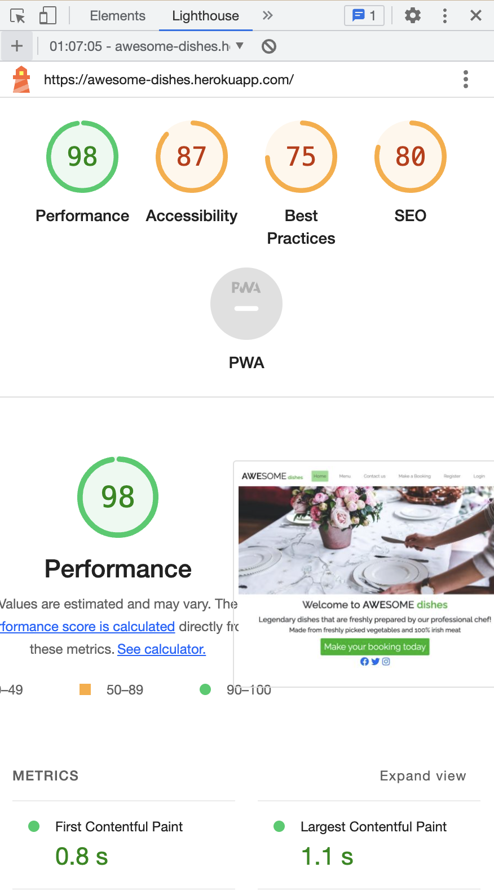
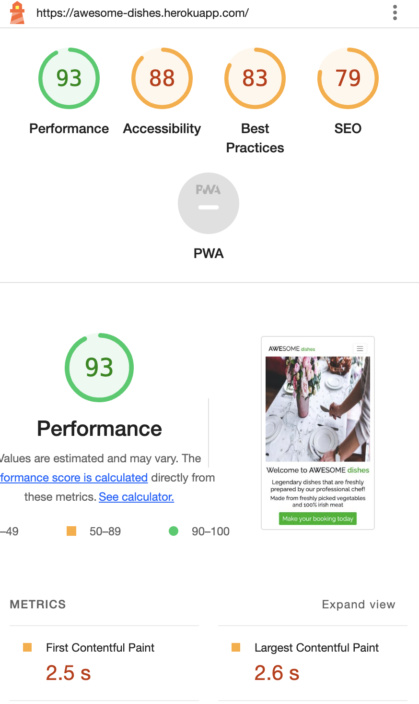
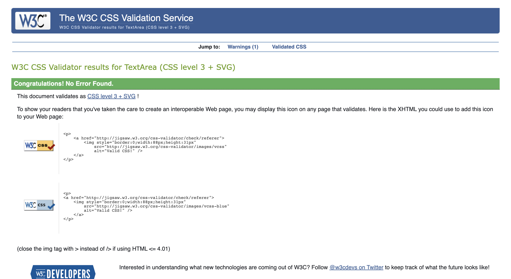
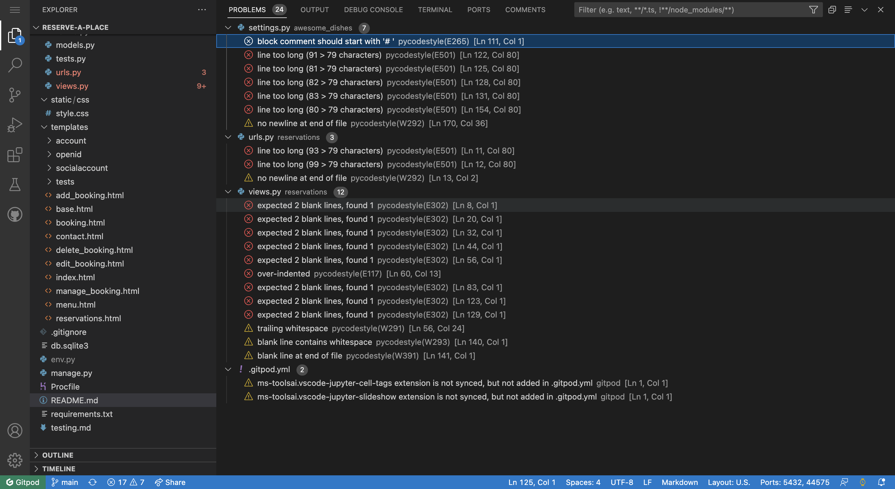
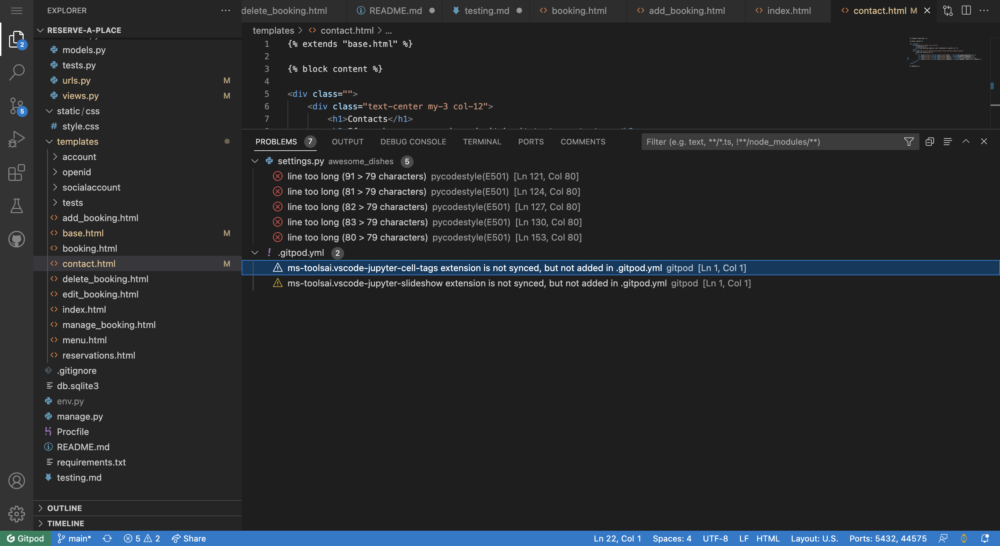

## 4.1 Manual Testing

### 4.1.1 Navigation Buttons

TEST            | OUTCOME                          | PASS / FAIL  
--------------- | -------------------------------- | ---------------
Home Button | When clicked, brings user to home page. | Pass
Menu Button | When clicked, brings user to menu page. | Pass
Contact Button | When clicked, brings user to contact page. | Pass
Sign in Button | When clicked, brings user to sign in page. | Pass
Sign up Button | When clicked, brings user to sign up page. | Pass
Manage Reservations Button | When clicked, brings user to a page with a list of reservations. | Pass
Edit Reservations Button | When clicked, brings user to a page where one can edit the booking details. | Pass
Delete Reservations Button | When clicked, brings user to a page that asks for whether the user wants to delete a reservation or not. | Pass
Logout Button | When clicked, brings user to a page that asks the user if s/he wants to logout or not. | Pass
Logo | When clicked, brings user back to home page. | Pass

### 4.1.2 Hover

TEST            | OUTCOME                          | PASS / FAIL  
--------------- | -------------------------------- | ---------------
Green Buttons | When hovered over, background-color of button turns blue. | Pass
Modify Booking Button | When hovered over, background-color of button turns deeper. | Pass
Delete Booking Button | When hovered over, background-color of button turns deeper. | Pass

### 4.1.3 Submit Buttons

TEST            | OUTCOME                          | PASS / FAIL  
--------------- | -------------------------------- | ---------------
Correct Items Clicked | When submit button is clicked, and everything is filled out correctly, will bring user back to reservation page.| Pass
Signin/Signup/Logout Clicked | When submit button is clicked, and everything is filled out correctly, will bring user back to home page.| Pass

### 4.1.4 Login/Logout/Signup

TEST            | OUTCOME                          | PASS / FAIL  
--------------- | -------------------------------- | ---------------
Login successful | When login is successful, a little message would pop up to tell you this. | Pass
Logout successful | When logout is successful, a little message would pop up to tell you this. | Pass
Signup successful | When signup is successful, a little message would pop up to tell you this. | Pass

### 4.1.5 Website Analysis on a Desktop using Lighthouse

The performance of my website is pretty good on the desktop browser. This is a compiled list of all the functions of the browser.

### 4.1.6 Website Analysis on a Mobile using Lighthouse

The performance of my website is mediocre on the mobile version. This is a compiled list of all the functions of the browser.

Both lighthouse analysis are pretty high but the best practices and SEO aren't great.

## 4.2 Testing with Tools

### 4.2.1 Am I responsive

I used the "Inspect" command on google chrome to check how responsive my website was with different screen sizes and appliances. These include:

- IPhone SE
- Iphone XR
- IPhone 12 Pro
- Pixel 5
- Samsung Galaxy S8+
- Samsung Galaxy S20 Ultra
- IPad Air
- IPad Mini
- Surface Pro 7
- Surface Duo
- Galaxy Fold
- Samsung Galaxy A51/71
- Nest Hub
- Nest Hub Max

The website worked well on all of them. None of them distorts the website in any significant way.

### 4.2.2 W3C Validator Tools

[W3C Markup](https://validator.w3.org/) was used to validate the html codes of my project. It was used to check if any errors were available and I had to correct them before continuing onto the next step. This was hard to do because the system didn't like me using python functions in between, therefore I had to go around the functions and added in little segments at a time. The other option was to paste everything in and when the problems showed up, I ignored the ones that was associated with the python code.

[W3C CSS Validation Service](https://jigsaw.w3.org/css-validator/) was used to check that all the code written in css were correct. Since most of the HTML code was decorated with Bootstrap, there wasn't a lot of css code. The image below tells me that there are no errors present in my code.

The terminal in gitpod was used to check for errors in my python code. 

These were the initial problems that were associated with my code. These were easily resolved by adding in indentations, getting rid of white spaces and adding an extra line between classes in the views.py file. The lines that were too long and caused a problem were shortened by separating them onto separate lines. Finally only some minor errors that were already present in the python code upon installing the package are left. Below is a picture that shows no major error in the code.

The Javascript that I have been using in this project came from an external source and when I pasted it in into , the system tells me that there were no errors that would have an impact on the code.

Return to the original readme file, press this [button](readme.md).
